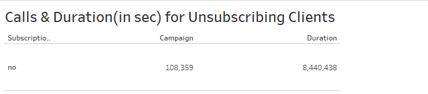
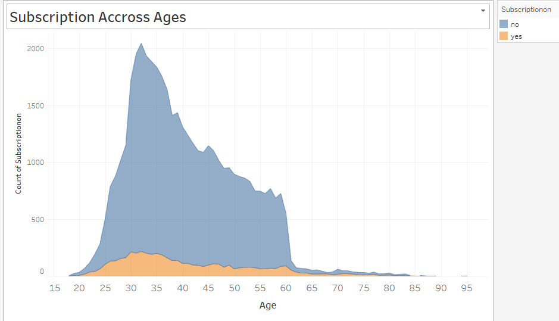
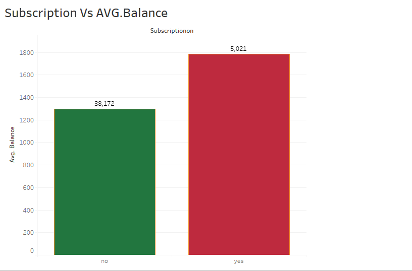
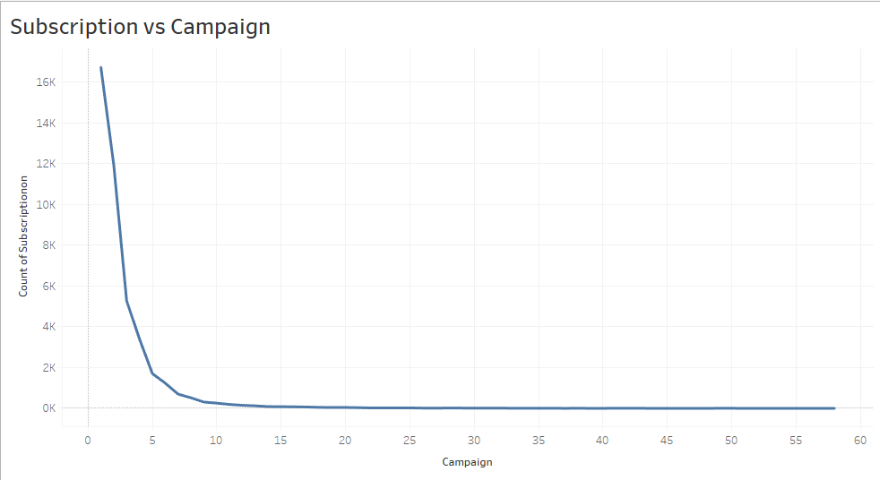
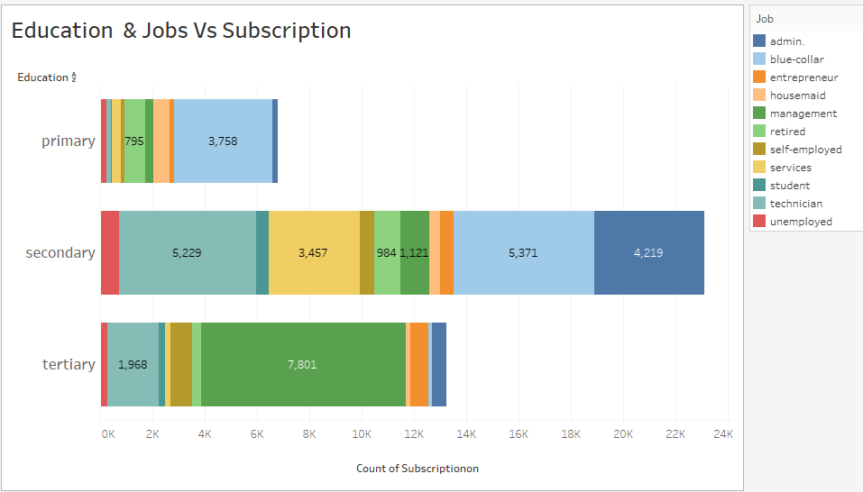
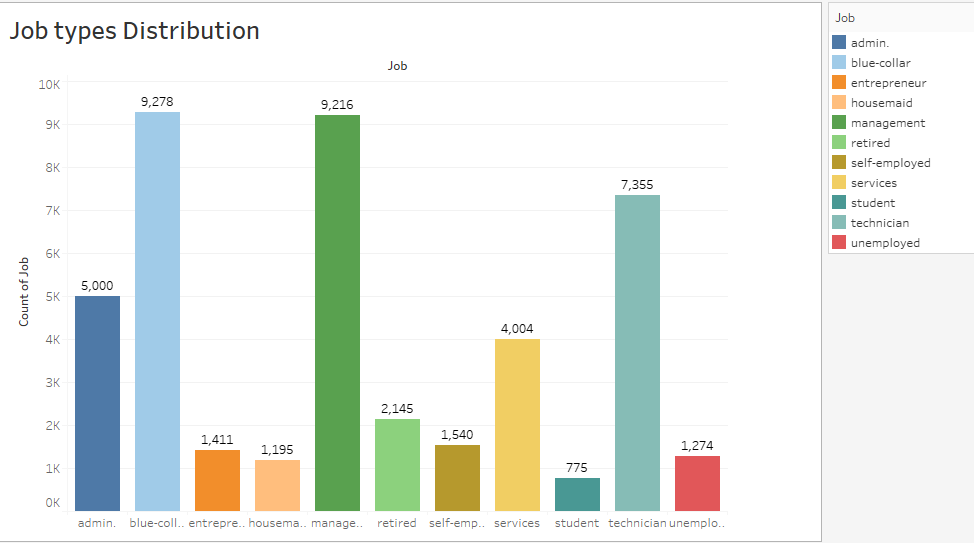

# Final Project - Optimized Marketing through Subscription Prediction

## Introduction

- In this final school project, I delve into the domain of marketing optimization by leveraging machine learning techniques to predict customer subscriptions for a Portuguese banking institution. The project aims to tackle the issue of ineffective telemarketing campaigns with a low conversion rate and devise a targeted strategy for better results.

## Problem Identified

- The existing telemarketing strategy yields a mere 11.6% conversion rate, leading to resource wastage, negative customer perception, and employee dissatisfaction. The project addresses these challenges and enhances the bank's marketing efforts. Right now from what can be quantified, 108,359 calls with a total duration of 8,440,438 seconds(2345 hours) have been spent unsubscribing clients.

## Project Description

- The core objective of this project is to develop a predictive model that identifies customers likely to subscribe to a term deposit. By deploying this model, the bank can implement a targeted telemarketing strategy, leading to increased success rates, resource savings, improved return on investment, positive brand perception, and enhanced employee morale.

## Project Workflow

- Data Loading: Load the dataset containing customer records and attributes.
- Data Cleaning: Clean the data, address missing values, and handle outliers.
- Exploratory Data Analysis (EDA): Explore the dataset to gain insights into customer characteristics and trends.
- Preprocessing: Convert categorical columns into numeric using one-hot encoding, normalize numerical distributions, and address class imbalance.
- Feature Engineering: Engineer relevant features to enhance model performance.
- Model Training: Utilize a Random Forest Classifier to train the predictive model.
- Model Evaluation: Assess model performance using appropriate evaluation metrics.
- Findings and Visualizations: Visualize insights from the dataset and the trained model.
- Business Implications: Analyze how the optimized marketing strategy can impact the bank's goals positively.
- Challenges: Discuss any challenges encountered during the project.
- Visual Glance of the Dataset

### Summary of observations in numerical Columns:

- Age: Ranges from 18 to 95, with an average of 41 years old.
- Bank Balance: Ranges from -8019.00 to 102,127.00, with an average balance of Euro 1362.
- Call Durations (seconds): Ranges from 0 to 4918, with an average duration of 258 seconds.
- Campaign (number of calls): Ranges from 1 to 63, with an average of 3 days.
- Pdays (Days since last contact): Ranges from -1 to 871, with an average of 40 days.
- Previous (previous calls to the client): Ranges from 0 to 275, with an average of 0.58.

### Categorical Columns:

- 21.5% have a blue-collar job.
- 60% are married.
- 51% have secondary education.
- 98% do not have default credit.
- 88% did not subscribe to the term deposit.

## Model Training & Evaluation Summary

- Addressed class imbalance within the Random Forest model.
- Achieved approximately 89% accuracy on test data.

## Business Implications

- Resource savings through reduced call volume and duration.
- Improved customer perception and brand image.
- Enhanced employee motivation and job satisfaction.

