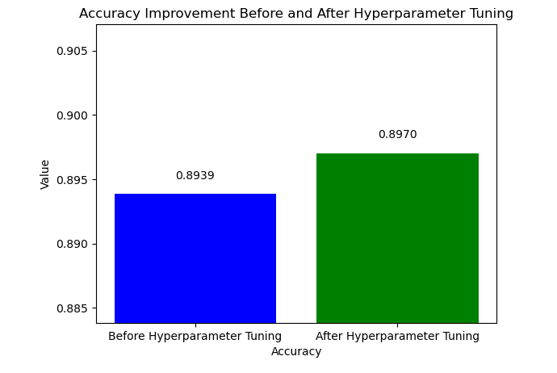

# Final Project - Optimized Marketing through Subscription Prediction

## Introduction

- In this final school project, I delve into the domain of marketing optimization by leveraging machine learning techniques to predict customer subscriptions for a Portuguese banking institution. The project aims to tackle the issue of ineffective telemarketing campaigns with a low conversion rate and devise a targeted strategy for better results.

### Dataset Description
- Our dataset contains approximately 43,000 instances of customer records, comprising 17 attributes ranging from customer balance, housing mortgage status, credit defaults, loans, education levels, job positions, the number and duration of the campaign calls, all the way to the final customer decision.

## Problem Identified

- The existing telemarketing strategy yields a mere 11.6% conversion rate, leading to resource wastage, negative customer perception, and employee dissatisfaction. The project addresses these challenges and enhances the bank's marketing efforts. Currently, in measurable terms, a significant number of calls—108,359 in total—amounting to 8,440,438 seconds (equivalent to 2345 hours/140,674 minutes) have been spent on clients who declined the opportunity to subscribe to the long-term offer.

 Vs Subscription.png>)

## Project Description

- The central aim of this project is to construct a predictive model capable of recognizing customers with a high likelihood of subscribing to a term deposit. The significance of achieving a heightened prediction accuracy cannot be overstated—it empowers us to channel our telemarketing endeavors towards those customers who are most inclined to subscribe. This achievement holds the potential to bring about a notable transformation.

- Through the utilization of this model, the bank can introduce a precisely targeted telemarketing approach, resulting in elevated success rates, efficient resource allocation, heightened return on investment, favorable brand reputation, and a boost in employee morale.

## Project Workflow

- Data Loading: Load the dataset containing customer records and attributes.
- Data Cleaning: Clean the data, address missing values, and handle outliers.
- Exploratory Data Analysis (EDA): Explore the dataset to gain insights into customer characteristics and trends.
- Preprocessing: Convert categorical columns into numeric using one-hot encoding, normalize numerical distributions, and address class imbalance.
- Feature Engineering: Engineer relevant features to enhance model performance.
- Model Training: Utilize a Random Forest Classifier to train the predictive model.
- Model Evaluation: Assess model performance using appropriate evaluation metrics.
- Findings and Visualizations: Visualize insights from the dataset and the trained model.
- Business Implications: Analyze how the optimized marketing strategy can impact the bank's goals positively.
- Challenges: Discuss any challenges encountered during the project.
- Visual Glance of the Dataset

## Summary of Major steps:
- We utilized a diverse set of tools such as Python, pandas, NumPy, matplotlib, seaborn, tableau, Scikit-learn, and SciPy. In the course of these efforts, we meticulously cleaned the data, eliminated extraneous attributes, standardized data for improved efficiency, tackled class imbalance within subscription instances, and implemented scaling techniques. This comprehensive approach was taken to establish a robust and solid groundwork for our model's construction.

### Summary of observations in numerical Columns:

- Age: Ranges from 18 to 95, with an average of 41 years old.
- Bank Balance: Ranges from -8019.00 to 102,127.00, with an average balance of Euro 1362.
- Call Durations (seconds): Ranges from 0 to 4918, with an average duration of 258 seconds.
- Campaign (number of calls): Ranges from 1 to 63, with an average of 3 days.
- Pdays (Days since last contact): Ranges from -1 to 871, with an average of 40 days.
- Previous (previous calls to the client): Ranges from 0 to 275, with an average of 0.58.

### Categorical Columns:

- 21.5% have a blue-collar job.
- 60% are married.
- 51% have secondary education.
- 98% do not have default credit.
- 88% did not subscribe to the term deposit.

## Major Problems in Dataset that were dealt:

- Skewed Distribution in allmost all numerical attributes except age. 

- Class imbalance in the target variable which is subscription and was handled within Random Forest Classification model.

## Model Training & Evaluation Summary

- The model was able to generalize with **89.38%** accuracy at first on the test data.
- Hyperparameter tunning applied and has slightly improved the accuracy to **89.70%**

## Business Implications
- In the past, the bank's telemarketing campaign achieved a subscription rate of approximately **1 out of 12 clients (roughly 11.62%)**. Now, with an **89%** predictive accuracy, we can strategically target potential customers likely to subscribe, leading to an anticipated subscription rate of about **9 out of 10 clients (around 89%)**. This transformation is expected to yield several positive outcomes for the business, including increased return on investment, minimized opportunity costs, optimized resource allocation, boosted employee morale, and an enhanced customer image and brand perception.

- This project exemplifies the power of data-driven decision-making and predictive modeling in transforming not only our marketing strategy but the entire trajectory of our business. Thank you for you taking the time to see the presentation.

## Challenges 
- The normalization of the data presented a challenge due to the presence of zero and negative values, which hold crucial significance in this context and cannot be substituted with the mean or omitted. This necessitated the exploration of an advanced transformation technique, which exceeded the scope of our curriculum. Eventually, I uncovered the "Yeo-Johnson" transformation method, specifically designed to normalize datasets containing zero and negative values.

- There was a constraint in pursuing an extensive number of iterations for hyperparameter tuning due to computational limitations.

## Future Plans:

- Investigate supplementary attributes that exert an influence on our predictions and incorporate them into our dataset.
- Contemplate the potential deployment of the model.

